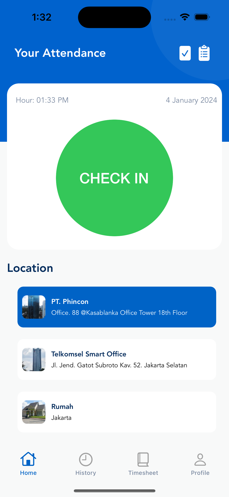
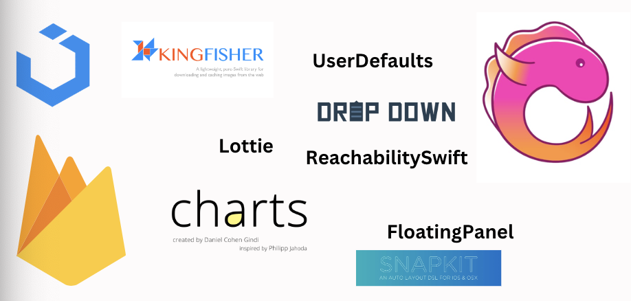
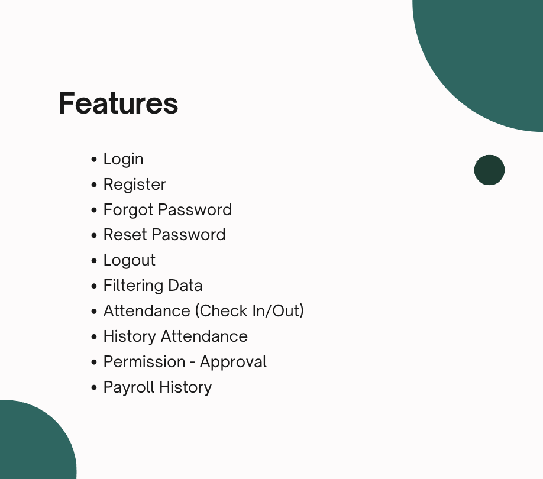

## Phincon Attendance

#### About a location-based attendance app with history, timesheets, and leave/sickness notes.

## Stack

- Core Library: UIKit
- View/UI: XIB (XML Interface Builder) for designing user interfaces
- Reactive Programming: Rx Package for handling reactive programming aspects
- Custom Components: Utilizing custom components for reusability
- Data Handling: Firebase Package for seamless data interaction

##

### Feature Highlights

